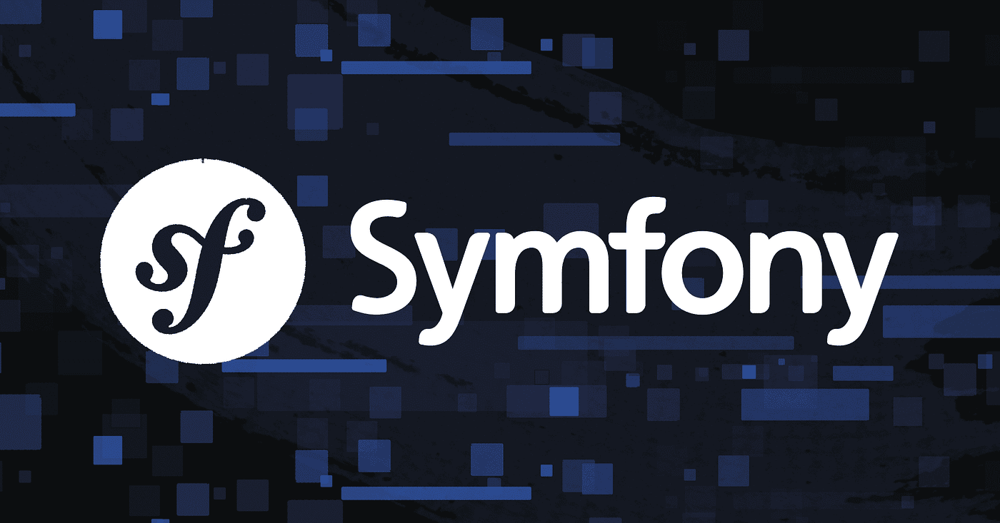

[](https://scrutinizer-ci.com/g/dafi-24/mvc/?branch=main)
[](https://scrutinizer-ci.com/g/dafi-24/mvc/?branch=main)
[](https://scrutinizer-ci.com/g/dafi-24/mvc/build-status/main)
[](https://scrutinizer-ci.com/code-intelligence)

# Komma igång med Symfony

En Symfony-baserad webbplats för redovisningstexter i kursmoment.

## Förberedelser

- Du måste ha PHP installerat i terminalen.
- Du måste ha Composer, PHP:s pakethanterare, installerad.

## Installation

Följ dessa steg för att installera och köra webbplatsen lokalt:

1. **Kopiera koden för övningen till din katalog**:
   ```bash
   # Gå till roten av kursens repo
   rsync -av example/symfony me/kmom01
   cd me/kmom01/symfony
   ```

2. **Skapa ett Symfony-projekt**:
   Installera ett projekt-skelett med Composer:
   ```bash
   composer create-project symfony/skeleton:"7.2.*" app
   cd app
   ```

3. **Installera beroenden**:
   Slutför installationen av webbapplikationen:
   ```bash
   composer require webapp
   ```

4. **Verifiera installationen**:
   Kontrollera vilka paket som är installerade:
   ```bash
   composer show
   ```

5. **Starta applikationen**:
   Starta den inbyggda PHP-servern:
   ```bash
   php -S localhost:8888 -t public
   ```

6. **Öppna i webbläsaren**:
   Navigera till `http://localhost:8888` för att se Symfony-välkomstsidan.
